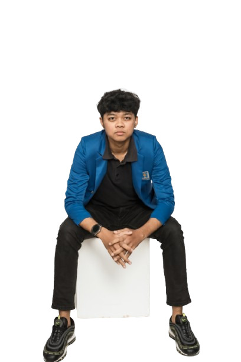

# Portfolio Rasyid Ahmad (v2)

This is the second iteration of my personal portfolio website, designed to showcase my projects, skills, and professional experience as a Fullstack Developer and UI/UX Designer. Built with modern web technologies for optimal performance and user experience.



## 🚀 Technologies

- **Framework:** [Next.js 14](https://nextjs.org/) (App Router)
- **Language:** TypeScript
- **Styling:** Tailwind CSS
- **Icons:** Lucide React
- **Animations:** Custom CSS & Tailwind classes

## ✨ Features

- **Dynamic Project Showcase:** Filterable projects by category (Web, Mobile, Design).
- **Interactive Experience:** Smooth scroll behaviors, hover effects, and slide animations.
- **Dark/Light Mode:** Fully supported theme switching with persistent preference.
- **Responsive Design:** Optimized for all device sizes from mobile to desktop.
- **Modern UI:** Glassmorphism effects, clean typography, and vibrant aesthetics.

## 🛠️ Getting Started

First, run the development server:

```bash
npm run dev
# or
yarn dev
# or
pnpm dev
# or
bun dev
```

Open [http://localhost:3000](http://localhost:3000) with your browser to see the result.

## 📁 Project Structure

- `/app`: App router pages and layouts
- `/components`: Reusable UI components
- `/public`: Static assets (images, videos)
- `/styles`: Global styles and Tailwind configuration

## 👤 Author

### Rasyid Ahmad

- GitHub: [@arapcihuy](https://github.com/arapcihuy)
- LinkedIn: [Rasyid Ahmad](https://www.linkedin.com/in/rasyid-ahmad-840b8b250/)

---
Created with Next.js and ❤️